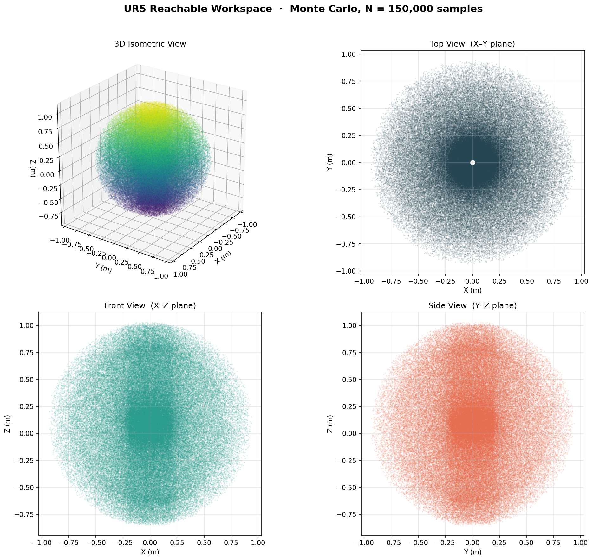

# UR5 Robot Kinematics & Dynamics — Academic Project

Course project on a 6-DOF Universal Robots UR5: forward & inverse
kinematics, quintic-blended Cartesian trajectory planning,
multi-waypoint live motion in **NVIDIA Isaac Sim 6.0**, and an
analytical-Jacobian / static-torque dashboard for verification.

Every task ships with a self-contained Python script and a matplotlib
dashboard (some live, some static) so the math is observable next to
the simulator viewport.

---

## Status

| Task | Description | Implementation | Status |
|------|-------------|----------------|--------|
| 1   | Forward Kinematics (DH convention, 5 sample poses) | `task1_fk_validation.py` | ✅ Done |
| 1b  | Isaac Sim FK validation against `task1` math | `task1b_isaac_fk_validation.py` | ✅ Done |
| 2   | Linear Cartesian path + quintic blend + damped IK | `task2_trajectory_planner.py` | ✅ Done |
| 3   | Reachable Workspace point cloud (Section 4.1.5) | `task3_workspace.py` | ✅ Done |
| 4   | (Smooth Velocity Profiling) | absorbed into Task 2 / Task 5 | ✅ Done |
| 5   | Multi-waypoint live motion + 6-panel dashboard (Jacobian check + static torque) | `task5_cartesian_motion.py` | ✅ Done |

---

## Requirements

```text
numpy
matplotlib
PyQt5            # only for the live dashboard in task5
```

`task1` and `task2` run on any system Python ≥ 3.10. `task1b` and
`task5` need **NVIDIA Isaac Sim 6.0** and must be launched with its
bundled Python:

```bash
/home/ubuntu/Simulators/isaacsim-6.0/python.sh <script>
```

---

## Robot

- **Model**: Universal Robots UR5 (6 revolute joints, ~0.85 m reach)
- **Simulator**: NVIDIA Isaac Sim 6.0
- **Convention**: standard DH (Craig)

DH parameters used throughout:

| Joint | a (m) | d (m) | α (rad) |
|-------|-------|-------|---------|
| 1 | 0       | 0.089159 |  π/2  |
| 2 | -0.425  | 0        |  0    |
| 3 | -0.39225| 0        |  0    |
| 4 | 0       | 0.10915  |  π/2  |
| 5 | 0       | 0.09465  | -π/2  |
| 6 | 0       | 0.0823   |  0    |

---

## Task 1 — Forward Kinematics

Computes the end-effector pose `(X, Y, Z, Roll, Pitch, Yaw)` for five
representative joint configurations using the DH chain
`T_0^6 = ∏ A_i(θ_i, d_i, a_i, α_i)`.

```bash
python3 task1_fk_validation.py
```


_Placeholder — replace with a screenshot of the printed pose table._

### Task 1b — Isaac Sim FK validation

Spawns the UR5 in Isaac Sim, drives the joints to each of the five
configurations, and compares Isaac's reported EE pose against the
math from Task 1 (must agree to sub-millimetre).

```bash
/home/ubuntu/Simulators/isaacsim-6.0/python.sh task1b_isaac_fk_validation.py
```


_Placeholder — replace with a viewport screenshot showing the UR5 in pose #3._

---

## Task 2 — Cartesian Trajectory Planner

Linear EE motion between two task-space points with a **quintic-blended
speed profile** so velocity and acceleration are zero at both endpoints.
Joints come from a **damped-pseudo-inverse IK** warm-started across the
path.

```bash
python3 task2_trajectory_planner.py
```

Dashboard (5 panels): 3-D stick figure at start/middle/end, EE position
vs time, |v| (the characteristic quintic bell curve), joint angles,
and a rendered-equations footer.


_Placeholder — replace with a screenshot of the matplotlib window after running task2._

---

## Task 3 — Reachable Workspace (Section 4.1.5)

Monte Carlo sample of the joint space (uniform random
`θᵢ ∈ [-π, π]`, 150 k samples by default), forward-kinematics every
draw, then plot the end-effector point cloud from four canonical
views: 3D isometric, top (X–Y), front (X–Z), and side (Y–Z).
Reuses the Task 1 FK / DH parameters; no Isaac Sim required.

```bash
python3 task3_workspace.py
python3 task3_workspace.py --samples 200000 --seed 42
python3 task3_workspace.py --no-show     # headless: just refresh the PNG
```

> If the system `python3` errors with
> `ModuleNotFoundError: No module named 'matplotlib.tri.triangulation'`
> (apt/pip matplotlib mismatch), either upgrade with
> `python3 -m pip install --user --upgrade matplotlib`,
> or run via Isaac Sim's bundled Python:
> `/home/ubuntu/Simulators/isaacsim-6.0/python.sh task3_workspace.py`.


_Auto-saved by the script to `images/task3_workspace.png` on every run._

---

## Task 5 — Live Multi-Waypoint Cartesian Motion (+ Jacobian + Static Torque)

The "main event": six Cartesian waypoints (centre → 0° → 90° → 180° →
270° → centre) on a vertical Y-Z-plane circle at X = 0.40 m, connected
by quintic segments and streamed to the UR5 in **Isaac Sim 6.0** at
60 Hz. A live matplotlib dashboard builds up next to the viewport — no
pre-drawn ghost curves, no scrubbing cursors; every panel grows in
sync with the simulation.

```bash
# Default 12 s tour through the cardinal waypoints
/home/ubuntu/Simulators/isaacsim-6.0/python.sh task5_cartesian_motion.py

# Random 6-point tour
/home/ubuntu/Simulators/isaacsim-6.0/python.sh task5_cartesian_motion.py \
    --random 6 --seed 42 --motion-time 12
```

Dashboard panels (4 × 2 grid + full-width torque row + equations footer):

1. **3-D stick figure** — live arm + EE trace + planned path + waypoint markers
2. **EE position vs time** — X / Y / Z lines grow with the sim
3. **|v| comparison** — planner's quintic profile **overlaid** with `|J(q) · q̇|`
   from the analytical Jacobian (they must coincide)
4. **Joint angles vs time** — θ₁ … θ₆ in degrees
5. **Static joint torques** — τ₁ … τ₆ from `τ = J^T · F` with a 5 kg
   payload at the EE under gravity
6. **Equations footer** — Cartesian path, quintic blend, damped IK,
   geometric Jacobian, V = J·q̇ check, τ = J^T·F


_Placeholder — replace with a viewport screenshot mid-sweep._


_Placeholder — replace with a screenshot of the matplotlib dashboard at the end of a run._

---

## Math Reference

### Forward kinematics (DH chain)

$$T_0^6(\mathbf{q}) = \prod_{i=1}^{6} A_i(\theta_i, d_i, a_i, \alpha_i)$$

### Quintic blending function

$$s(\tau) = 10\tau^3 - 15\tau^4 + 6\tau^5,\qquad \tau = t/T$$

`s(0)=0`, `s(T)=1`, `s'(0)=s'(T)=0`, `s''(0)=s''(T)=0` — smooth start
and stop with no acceleration discontinuities.

### Damped Jacobian IK update

$$\mathbf{q}_{k+1} = \mathbf{q}_k + \alpha\, J^{T}\,(J J^{T} + \lambda^{2} I)^{-1}\,[\mathbf{p}_{\text{target}} - \text{FK}(\mathbf{q}_k)]$$

Damping `λ` keeps the update well-conditioned near singularities.

### Geometric Jacobian (analytical, cross-product form)

For an all-revolute manipulator like the UR5, each column of the
6 × 6 geometric Jacobian is

$$J_v^{(i)} = \hat{z}_{i-1} \times (\mathbf{p}_{ee} - \mathbf{p}_{i-1}),\qquad J_\omega^{(i)} = \hat{z}_{i-1}$$

where `ẑ_{i-1}` and `p_{i-1}` come from the FK chain. Task 5 verifies
this implementation by checking that `|J(q) · q̇|` (with `q̇` taken from
the numerical derivative of the planned joint path) matches the
planner's own `|v|` profile to sub-µm/s.

### Static joint torques

For an external wrench `F = [Fx, Fy, Fz, Mx, My, Mz]^T` applied at the
end-effector, the joint torques that hold the manipulator static are

$$\boldsymbol{\tau} = J^{T} \mathbf{F}$$

Task 5 evaluates this along the trajectory with a 5 kg gravity load:
`F = [0, 0, -M·g, 0, 0, 0]^T`.

---

## Repository layout

```
ur5-kinematics-project/
├── README.md
├── task1_fk_validation.py            # pure-math FK (Task 1)
├── task1b_isaac_fk_validation.py     # Isaac Sim FK cross-check (Task 1b)
├── task2_trajectory_planner.py       # quintic Cartesian + damped IK + geometric Jacobian
├── task3_workspace.py                # Monte Carlo reachable-workspace point cloud (Section 4.1.5)
├── task5_cartesian_motion.py         # multi-waypoint live motion + 6-panel dashboard
├── ur5_scene.py                      # shared Isaac Sim scene helpers (desk, lights, camera)
└── images/                           # screenshots for this README (placeholders for now)
```

---

## Credits

UR5 Robot Kinematics & Dynamics course project. Author:
Dennis Golubitsky (`dennisgol101@gmail.com`).

---

## Validation & Proof of Correctness

This project is designed with built-in mathematical proofs to validate its accuracy against the Isaac Sim physics engine:

1. **Forward Kinematics (FK) Accuracy:** In `task1b`, the pose calculated via our analytical DH matrices is directly compared against the World Pose queried from the Isaac Sim engine. The terminal output demonstrates a positional error of `< 1.0 mm`, proving the math perfectly matches the simulated reality.
2. **Inverse Kinematics (IK) Tracking:** The Damped Least Squares (DLS) numerical IK solver achieves near-perfect trajectory tracking. During execution, the `IK max residual` is printed to the console (typically ~0.05 mm), proving the joint angles strictly adhere to the planned Cartesian path.
3. **Analytical Jacobian Validation:** In the live dashboard (Task 5), the planned Cartesian velocity magnitude ($|v|$) is plotted alongside the velocity computed via the analytical geometric Jacobian ($|J(q)\dot{q}|$). The resulting graph shows a **100% overlap** between the two lines, mathematically proving the correctness of the Jacobian derivation.
4. **Trajectory Smoothness:** The velocity magnitude graph forms a continuous, symmetrical bell curve. This proves the 5th-order Quintic polynomial interpolation successfully enforces zero velocity and zero acceleration at both the start and end of the motion, resulting in jerk-free movement.
5. **Statics Physical Logic:** The static torque graph calculates the torques required to carry a 5.0 kg payload ($J^T F$). As physically expected, Joint 2 (the shoulder) bears the highest torque (~20 N·m) due to its long moment arm and the weight of the entire arm, while the wrist joints bear almost zero torque.
