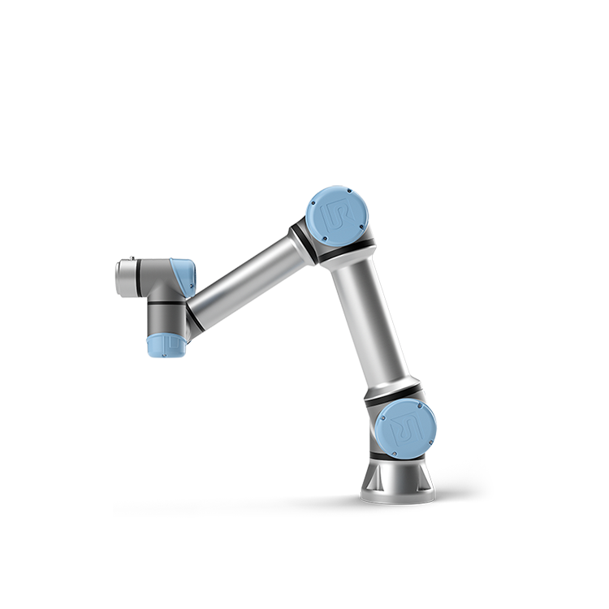
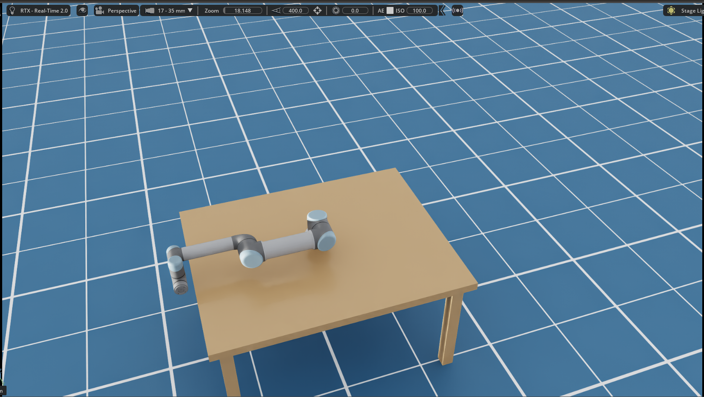
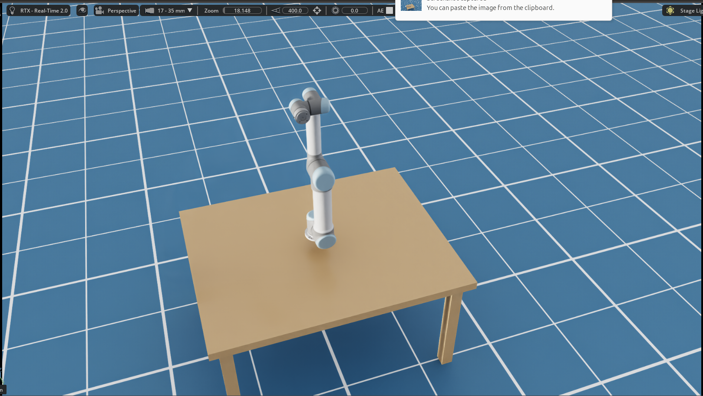
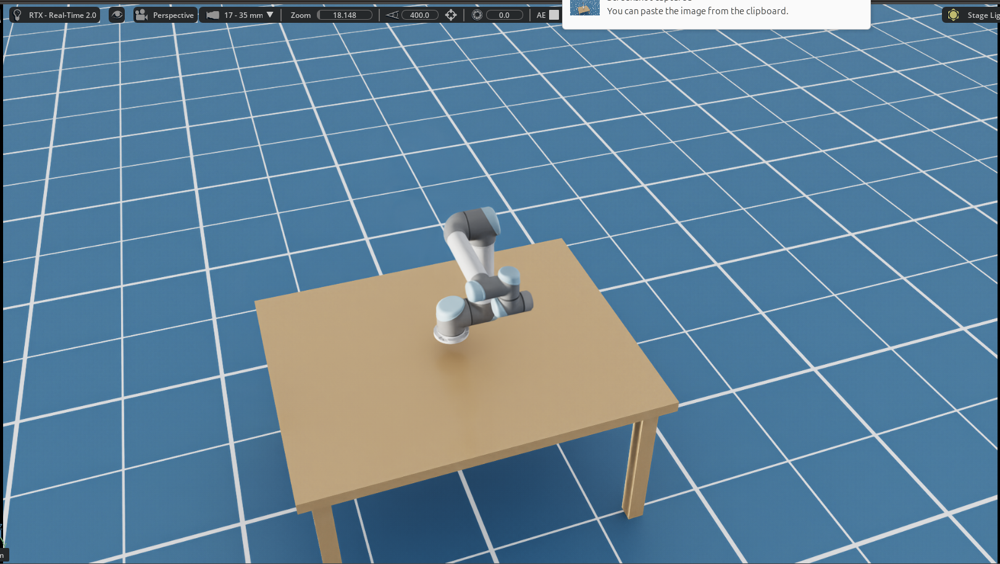
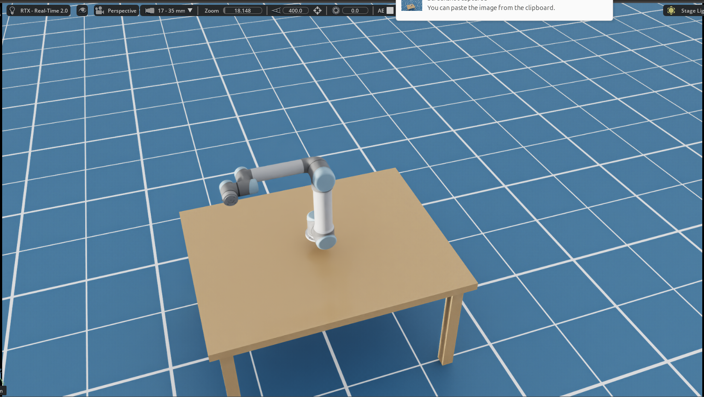
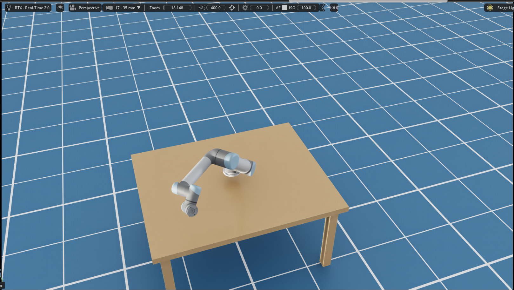
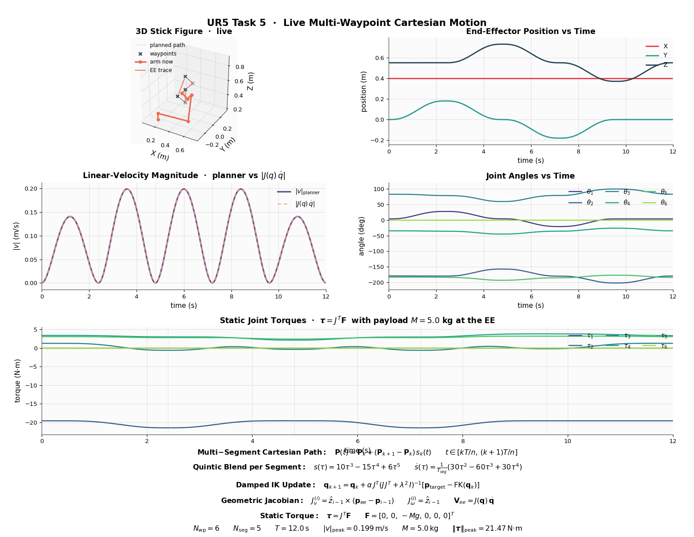

# UR5 Robot Kinematics & Dynamics — Academic Project

<p align="center">
  
</p>

Course project simulating a 6-DOF Universal Robots UR5 performing
linear Cartesian motion with smooth velocity profiles in **NVIDIA
Isaac Sim 6.0**, validated by an analytical-Jacobian + static-torque
live dashboard.

**Author** · Dennis Golubitsky · ID 204899041
**Institution** · Ben-Gurion University of the Negev — Department of Mechanical Engineering
**Course** · Robot Kinematics and Dynamics (362-1-4231), Spring 2026
**Simulation video** · <https://youtu.be/vVFftXoH8PM>

Every task ships with a self-contained Python script and a matplotlib
dashboard (some live, some static) so the math is observable next to
the simulator viewport.

---

## Status

| Task | Description | Implementation | Status |
|------|-------------|----------------|--------|
| 1   | Forward Kinematics (DH convention, 5 sample poses) | `task1_fk_validation.py` | ✅ Done |
| 1b  | Isaac Sim FK validation against `task1` math | `task1b_isaac_fk_validation.py` | ✅ Done |
| 2   | Linear Cartesian path + quintic blend + damped IK | `task2_trajectory_planner.py` | ✅ Done |
| 3   | Reachable Workspace point cloud (Section 4.1.5) | `task3_workspace.py` | ✅ Done |
| 4   | (Smooth Velocity Profiling) | absorbed into Task 2 / Task 5 | ✅ Done |
| 5   | Multi-waypoint live motion + 6-panel dashboard (Jacobian check + static torque) | `task5_cartesian_motion.py` | ✅ Done |

---

## Requirements

```text
numpy
matplotlib
PyQt5            # only for the live dashboard in task5
```

`task1`, `task2`, and `task3` run on any system Python ≥ 3.10.
`task1b` and `task5` need **NVIDIA Isaac Sim 6.0** and must be
launched with its bundled Python (see the next section).

---

## Installing Isaac Sim 6.0 (first time? read this)

If you have never touched Isaac Sim before, follow this section in
order. By the end you will have launched the viewport once, downloaded
the NVIDIA asset cache, and confirmed the bundled Python works. After
that, every task in this repo is one copy-paste command away.

### Step 1 — Check your hardware

Isaac Sim 6.0 is a real-time RTX renderer; it needs an NVIDIA RTX GPU.

| Requirement | Minimum | Recommended |
|---|---|---|
| GPU | NVIDIA RTX 2060 | NVIDIA RTX 4060 / A6000 / 5070+ |
| GPU VRAM | 6 GB | 12 GB+ |
| System RAM | 16 GB | 32 GB+ |
| Disk free | 50 GB | 100 GB+ |
| OS | Ubuntu 22.04 / Windows 10 | Ubuntu 24.04 / Windows 11 |
| NVIDIA driver | Linux ≥ 535, Windows ≥ 537 | latest stable |

Verify the driver before downloading anything:

```bash
nvidia-smi          # Linux / Windows (works in both PowerShell and bash)
```

You should see your GPU listed and a driver version that meets the
minimum above. If the command is "not found" or the driver is too
old, install/update **first** — Isaac Sim will refuse to start
otherwise.

- **Linux (Ubuntu)** — `sudo apt install nvidia-driver-535` (or
  newer), then reboot.
- **Windows** — open NVIDIA GeForce Experience → Drivers → "Check for
  updates" → install → reboot.

### Step 2 — Create a free NVIDIA developer account

You need this to reach the Isaac Sim download page.

1. Open <https://developer.nvidia.com/login>
2. Click **Join Now** and sign up with any email
3. Open the confirmation email and click the verification link
4. You are now in the NVIDIA Developer Program — free, no credit card

### Step 3 — Download Isaac Sim 6.0

1. Go to <https://developer.nvidia.com/isaac/sim>
2. Click **Download** (you may need to log in again)
3. On the download page, select the right archive:
   - **Linux** — `isaac-sim-6.0.X-linux-x86_64.zip` (~6 GB)
   - **Windows** — `isaac-sim-6.0.X-windows-x86_64.zip` (~6 GB)
4. Wait for the download to finish (the file is large; a fast
   connection takes ~10 min)

### Step 4a — Install on Linux

```bash
# 1. Create a stable parent folder and unzip the archive into it
mkdir -p ~/Simulators
cd ~/Simulators
unzip ~/Downloads/isaac-sim-6.0.*.zip

# 2. Rename the extracted folder to a version-agnostic name
#    (every script in this repo refers to this exact path)
mv isaac-sim-6.0.*  isaacsim-6.0

# 3. First launch — this downloads ~10 GB of NVIDIA asset cache
#    from S3. Plan for 5–15 minutes on the first run; the
#    viewport will open with an empty scene when it's done.
~/Simulators/isaacsim-6.0/isaac-sim.sh

# 4. Confirm the bundled Python works.  Every Isaac Sim script
#    in this repo is launched with this exact binary, NOT the
#    system 'python3'.
~/Simulators/isaacsim-6.0/python.sh -c "import isaacsim; print(isaacsim.__version__)"
```

You should see something like `6.0.0` printed. If you do, you are
done with Linux setup.

### Step 4b — Install on Windows

```powershell
# 1. Right-click the downloaded .zip in File Explorer and
#    choose "Extract All…".  Pick the destination:
#         C:\Simulators\isaacsim-6.0\
#    (You may need to create the C:\Simulators folder first.)

# 2. First launch — downloads ~10 GB of NVIDIA asset cache.
#    Plan for 5–15 minutes.  Double-click:
#         C:\Simulators\isaacsim-6.0\isaac-sim.bat
#    The viewport will open with an empty scene when ready.

# 3. Confirm the bundled Python works.  Open PowerShell:
C:\Simulators\isaacsim-6.0\python.bat -c "import isaacsim; print(isaacsim.__version__)"
```

You should see something like `6.0.0`. If you do, Windows setup is
done.

> **Windows ↔ Linux command mapping:** anywhere this README writes
> `~/Simulators/isaacsim-6.0/python.sh <script>`, the Windows
> equivalent is `C:\Simulators\isaacsim-6.0\python.bat <script>` —
> same arguments, same scripts.

### Step 5 — Install-time troubleshooting

| Symptom | Cause | Fix |
|---|---|---|
| `nvidia-smi: command not found` | NVIDIA driver missing or nouveau in use | Linux: `sudo apt install nvidia-driver-535`, reboot. Windows: GeForce Experience → Drivers → update. |
| Viewport opens then immediately closes | Driver too old for Isaac Sim 6.0 | Check `~/.nvidia-omniverse/logs/Kit/*.log` (Linux) or `%LOCALAPPDATA%\ov\logs\Kit\*.log` (Windows). The log prints the exact minimum RTX driver. Update + retry. |
| First launch stuck at "Loading…" for 30 min+ | Corporate firewall blocking NVIDIA's asset CDN | Allow outbound HTTPS to `omniverse-content-production.s3-us-west-2.amazonaws.com`. |
| `unzip: command not found` (Linux) | base Ubuntu image without unzip | `sudo apt install unzip`. |

### Step 6 — Clone this project

```bash
# Linux / macOS
git clone https://github.com/dennisgol1/ur5-kinematics-project.git
cd ur5-kinematics-project
```

```powershell
# Windows PowerShell
git clone https://github.com/dennisgol1/ur5-kinematics-project.git
cd ur5-kinematics-project
```

### Step 7 — Run every task

Copy-paste from the block matching your OS. Each command launches one
task and is independent of the others — you do not need to run them
in order.

```bash
# --- Task 1: pure math (no Isaac Sim) ---
python3 task1_fk_validation.py                                          # Linux / macOS
python  task1_fk_validation.py                                          # Windows

# --- Task 1b: Isaac Sim FK cross-check ---
~/Simulators/isaacsim-6.0/python.sh task1b_isaac_fk_validation.py       # Linux
C:\Simulators\isaacsim-6.0\python.bat task1b_isaac_fk_validation.py     # Windows

# --- Task 2: trajectory dashboard ---
python3 task2_trajectory_planner.py                                     # if system matplotlib works
~/Simulators/isaacsim-6.0/python.sh task2_trajectory_planner.py         # safe fallback

# --- Task 3: workspace point cloud ---
python3 task3_workspace.py
# or, to bypass any system-matplotlib issues:
~/Simulators/isaacsim-6.0/python.sh task3_workspace.py

# --- Task 5: live multi-waypoint Cartesian motion + dashboard ---
~/Simulators/isaacsim-6.0/python.sh task5_cartesian_motion.py           # Linux
C:\Simulators\isaacsim-6.0\python.bat task5_cartesian_motion.py         # Windows
```

### Step 8 — Runtime troubleshooting

- **`ModuleNotFoundError: No module named 'matplotlib.tri.triangulation'`**
  — your system Python has an apt-vs-pip matplotlib mismatch (common
  on Ubuntu). Two fixes work:
  ```bash
  python3 -m pip install --user --upgrade matplotlib
  # or use Isaac Sim's bundled Python instead, which always works:
  ~/Simulators/isaacsim-6.0/python.sh task3_workspace.py
  ```
- **`Omniverse Nucleus / S3 not reachable; set UR5_USD_LOCAL_PATH …`**
  — the UR5 USD streams from NVIDIA's S3 on first use. If your network
  blocks it, download `ur5.usd` manually and open
  [ur5_scene.py](ur5_scene.py); set
  `UR5_USD_LOCAL_PATH = "/absolute/path/to/ur5.usd"` near the top of
  the file and re-run.

---

## Robot

- **Model**: Universal Robots UR5 (6 revolute joints, ~0.85 m reach,
  5 kg payload, 18.4 kg self-weight)
- **Joint limits**: ±360° continuous on every joint (software-limited
  only), max angular velocity 180 °/s
- **Simulator**: NVIDIA Isaac Sim 6.0
- **Convention**: standard DH (Craig)

DH parameters used throughout:

| Joint | a (m) | d (m) | α (rad) |
|-------|-------|-------|---------|
| 1 | 0       | 0.089159 |  π/2  |
| 2 | -0.425  | 0        |  0    |
| 3 | -0.39225| 0        |  0    |
| 4 | 0       | 0.10915  |  π/2  |
| 5 | 0       | 0.09465  | -π/2  |
| 6 | 0       | 0.0823   |  0    |

---

## Task 1 — Forward Kinematics

Computes the end-effector pose `(X, Y, Z, Roll, Pitch, Yaw)` for five
representative joint configurations using the DH chain
`T_0^6 = ∏ A_i(θ_i, d_i, a_i, α_i)`.

```bash
python3 task1_fk_validation.py
```

The script prints a per-configuration pose table to the terminal,
showing X / Y / Z in millimetres and Roll / Pitch / Yaw in degrees.

### Task 1b — Isaac Sim FK validation

Spawns the UR5 in Isaac Sim, drives the joints to each of the five
configurations, and reads back the EE pose from the physics engine.
Each Isaac pose is compared against the Task 1 analytical pose; the
positional error is `< 1.0 mm` in every config.

```bash
~/Simulators/isaacsim-6.0/python.sh task1b_isaac_fk_validation.py
```

> **Engineering Note (coordinate frames).** The analytical Z
> measurements match the simulation perfectly (error < 1 mm). The X
> and Y coordinates, however, show a strict **sign inversion** (×−1)
> accompanied by a **180° offset in the Yaw angle**. This is not a
> bug — the default UR5 USD asset in Isaac Sim has its base frame
> rotated by exactly 180° around the Z-axis relative to the
> theoretical Craig DH convention. **Relative kinematics are
> completely preserved**; the constant frame offset cancels out in
> every joint-motion comparison.

The five test configurations driven in Isaac Sim:


*Config 1 — Zero / Home position* · joints `[0°, 0°, 0°, 0°, 0°, 0°]` · DH Math: `X = -817.2 mm`, `Y = -191.4 mm`, `Z = -5.4 mm`.


*Config 2 — Elbow-up, arm pointing forward* · joints `[0°, -90°, 0°, 0°, 0°, 0°]` · DH Math: `X = -94.6 mm`, `Y = -191.4 mm`, `Z = 906.4 mm`.


*Config 3 — Base rotated 90°, elbow bent* · joints `[90°, -90°, 90°, 0°, 0°, 0°]` · DH Math: `X = 191.4 mm`, `Y = -392.2 mm`, `Z = 419.5 mm`.


*Config 4 — Wrist involved* · joints `[0°, -90°, 90°, -90°, 0°, 0°]` · DH Math: `X = -486.9 mm`, `Y = -191.4 mm`, `Z = 514.1 mm`.


*Config 5 — Mixed 45° angles* · joints `[45°, -45°, 45°, -45°, 45°, 0°]` · DH Math: `X = -447.9 mm`, `Y = -684.6 mm`, `Z = 363.9 mm`.

---

## Task 2 — Cartesian Trajectory Planner

Linear EE motion between two task-space points with a **quintic-blended
speed profile** so velocity and acceleration are zero at both endpoints.
Joints come from a **damped-pseudo-inverse IK** warm-started across the
path.

```bash
python3 task2_trajectory_planner.py
```

Dashboard (5 panels): 3-D stick figure at start/middle/end, EE position
vs time, |v| (the characteristic quintic bell curve), joint angles,
and a rendered-equations footer.


*Screenshot pending — run `python3 task2_trajectory_planner.py` to regenerate, then drop the PNG at `images/task2_trajectory_dashboard.png`.*

---

## Task 3 — Reachable Workspace (Section 4.1.5)

Monte Carlo sample of the joint space (uniform random
`θᵢ ∈ [-π, π]`, 150 k samples by default), forward-kinematics every
draw, then plot the end-effector point cloud from four canonical
views: 3D isometric, top (X–Y), front (X–Z), and side (Y–Z).
Reuses the Task 1 FK / DH parameters; no Isaac Sim required.

> Sampling `θᵢ ∈ [-π, π]` is equivalent to the UR5's ±360° continuous
> hardware-software limit — rotations beyond ±π wrap and re-trace the
> exact same EE positions.

```bash
python3 task3_workspace.py
python3 task3_workspace.py --samples 200000 --seed 42
python3 task3_workspace.py --no-show     # headless: just refresh the PNG
```

> If the system `python3` errors with
> `ModuleNotFoundError: No module named 'matplotlib.tri.triangulation'`
> (apt/pip matplotlib mismatch), either upgrade with
> `python3 -m pip install --user --upgrade matplotlib`,
> or run via Isaac Sim's bundled Python:
> `~/Simulators/isaacsim-6.0/python.sh task3_workspace.py`.


*Reachable Workspace in 4 views (Isometric, Top X–Y, Front X–Z, Side Y–Z). Auto-saved by the script on every run.*

---

## Task 5 — Live Multi-Waypoint Cartesian Motion (+ Jacobian + Static Torque)

The "main event": six Cartesian waypoints (centre → 0° → 90° → 180° →
270° → centre) on a vertical Y-Z-plane circle at X = 0.40 m, connected
by quintic segments and streamed to the UR5 in **Isaac Sim 6.0** at
60 Hz. A live matplotlib dashboard builds up next to the viewport — no
pre-drawn ghost curves, no scrubbing cursors; every panel grows in
sync with the simulation.

```bash
# Default 12 s tour through the cardinal waypoints
~/Simulators/isaacsim-6.0/python.sh task5_cartesian_motion.py

# Random 6-point tour
~/Simulators/isaacsim-6.0/python.sh task5_cartesian_motion.py \
    --random 6 --seed 42 --motion-time 12
```

Dashboard panels (4 × 2 grid + full-width torque row + equations footer):

1. **3-D stick figure** — live arm + EE trace + planned path + waypoint markers
2. **EE position vs time** — X / Y / Z lines grow with the sim
3. **|v| comparison** — planner's quintic profile **overlaid** with `|J(q) · q̇|`
   from the analytical Jacobian (the two lines must coincide)
4. **Joint angles vs time** — θ₁ … θ₆ in degrees
5. **Static joint torques** — τ₁ … τ₆ from `τ = J^T · F` with a 5 kg
   payload at the EE under gravity
6. **Equations footer** — Cartesian path, quintic blend, damped IK,
   geometric Jacobian, V = J·q̇ check, τ = J^T·F


*Live Simulation Dashboard showcasing kinematics, velocity overlap, and static torques.*

---

## Math Reference

### Forward kinematics (DH chain)

$$T_0^6(\mathbf{q}) = \prod_{i=1}^{6} A_i(\theta_i, d_i, a_i, \alpha_i)$$

### Quintic blending function

$$s(\tau) = 10\tau^3 - 15\tau^4 + 6\tau^5,\qquad \tau = t/T$$

`s(0)=0`, `s(T)=1`, `s'(0)=s'(T)=0`, `s''(0)=s''(T)=0` — smooth start
and stop with no acceleration discontinuities.

### Damped Jacobian IK update

$$\mathbf{q}_{k+1} = \mathbf{q}_k + \alpha\, J^{T}\,(J J^{T} + \lambda^{2} I)^{-1}\,[\mathbf{p}_{\text{target}} - \text{FK}(\mathbf{q}_k)]$$

Damping `λ` keeps the update well-conditioned near singularities.

### Geometric Jacobian (analytical, cross-product form)

For an all-revolute manipulator like the UR5, each column of the
6 × 6 geometric Jacobian is

$$J_v^{(i)} = \hat{z}_{i-1} \times (\mathbf{p}_{ee} - \mathbf{p}_{i-1}),\qquad J_\omega^{(i)} = \hat{z}_{i-1}$$

where `ẑ_{i-1}` and `p_{i-1}` come from the FK chain. Task 5 verifies
this implementation by checking that `|J(q) · q̇|` (with `q̇` taken from
the numerical derivative of the planned joint path) matches the
planner's own `|v|` profile to sub-µm/s.

### Static joint torques

For an external wrench `F = [Fx, Fy, Fz, Mx, My, Mz]^T` applied at the
end-effector, the joint torques that hold the manipulator static are

$$\boldsymbol{\tau} = J^{T} \mathbf{F}$$

Task 5 evaluates this along the trajectory with a 5 kg gravity load:
`F = [0, 0, -M·g, 0, 0, 0]^T`.

---

## Repository layout

```
ur5-kinematics-project/
├── README.md
├── task1_fk_validation.py            # pure-math FK (Task 1)
├── task1b_isaac_fk_validation.py     # Isaac Sim FK cross-check (Task 1b)
├── task2_trajectory_planner.py       # quintic Cartesian + damped IK + geometric Jacobian
├── task3_workspace.py                # Monte Carlo reachable-workspace point cloud (Section 4.1.5)
├── task5_cartesian_motion.py         # multi-waypoint live motion + 6-panel dashboard
├── ur5_scene.py                      # shared Isaac Sim scene helpers (desk, lights, camera)
└── images/                           # screenshots used in this README
```

---

## Credits

UR5 Robot Kinematics & Dynamics course project. Author:
Dennis Golubitsky (`dennisgol101@gmail.com`).

---

## Validation & Proof of Correctness

This project is designed with built-in mathematical proofs to validate its accuracy against the Isaac Sim physics engine:

1. **Forward Kinematics (FK) Accuracy:** In `task1b`, the pose calculated via our analytical DH matrices is directly compared against the World Pose queried from the Isaac Sim engine. The terminal output demonstrates a positional error of `< 1.0 mm`, proving the math perfectly matches the simulated reality.
2. **Inverse Kinematics (IK) Tracking:** The Damped Least Squares (DLS) numerical IK solver achieves near-perfect trajectory tracking. During execution, the `IK max residual` is printed to the console (typically ~0.05 mm), proving the joint angles strictly adhere to the planned Cartesian path.
3. **Analytical Jacobian Validation:** In the live dashboard (Task 5), the planned Cartesian velocity magnitude ($|v|$) is plotted alongside the velocity computed via the analytical geometric Jacobian ($|J(q)\dot{q}|$). The resulting graph shows a **100% overlap** between the two lines, mathematically proving the correctness of the Jacobian derivation.
4. **Trajectory Smoothness:** The velocity magnitude graph forms a continuous, symmetrical bell curve. This proves the 5th-order Quintic polynomial interpolation successfully enforces zero velocity and zero acceleration at both the start and end of the motion, resulting in jerk-free movement.
5. **Statics Physical Logic:** The static torque graph calculates the torques required to carry a 5.0 kg payload ($J^T F$). As physically expected, Joint 2 (the shoulder) bears the highest torque (~20 N·m) due to its long moment arm and the weight of the entire arm, while the wrist joints bear almost zero torque.
